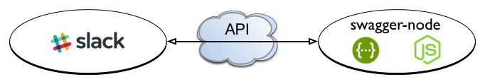

# Integrate your Slack with Swagger!

[Slack](https://slack.com/), one of the [hottest startups today](http://www.computerworld.com/article/2883834/the-rise-and-rise-of-slack-silicon-valleys-hottest-startup.html), is a messaging app for team communication. One reason is because so many external services, like GitHub, Google Drive, Heroku, Jira, and many others, come as [out-of-the-box integrations](https://slack.com/integrations). But one exceptionally nice feature is how easy it is to create your own custom functionality. 

Today, we'll walk you through creating your own Slack integration using [swagger-node](https://github.com/swagger-api/swagger-node), which makes it easy to build, validate, and test API projects locally and deploy them to any Cloud platform that supports Node.js. 

In this case, we'll be creating an API to fetch a stock quote, which will then be posted directly into a Slack team conversation, using what Slack calls an "Incoming WebHook" integration.



The back-end resource for this will be `/ticker`, which you could cURL:

`curl -X POST -H "Content-Type: application/x-www-form-urlencoded" http://localhost:10010/ticker -d "text=AAPL`

...and get back a nicely formatted response in Slack, like this:


We'll run and test the API locally; however, it can be deployed to any Cloud platform that supports Node.js, such as Apigee, AWS, or Heroku (more on deployment later).

## Before you begin

If you're going to try to do the steps outlined below, you must be a member of a Slack team or create a new one. In either case, you need to have permission to create integrations.

## Get the sample swagger-node-slack app from GitHub

To make things extra-simple, you can download a working project:

1. Download or clone the [swagger-node-slack](https://github.com/apigee-127/swagger-node-slack) project on GitHub. 

2. cd to the root project directory `swagger-node-slack`. 

3. Execute this command to get the Node.js dependencies:

    `npm install`


## Building the Ticker-bot integration

Let's walk through the steps for integrating the `/ticker` API with Slack. We're not going to go overboard to explain how to set things up in Slack, but we'll give pointers to keep you on track. It's remarkably easy. 

### But first, a quick peek under the hood

Let's take a quick look at the `swagger-node-slack` project. 

>If you're not familiar with the `swagger` NPM module project structure, you can check out [the docs](https://github.com/swagger-api/swagger-node/blob/master/docs/introduction.md), and try the quick-start tutorial if you like. 

The key to understanding how the `swagger-node-slack` API works is to look at these two files:

* `./swagger-node-slack/api/swagger/swagger.yaml` -- This is the Swagger definition for the API. Note that it defines the paths, operations, and parameters for the API. You can use the built in editor to make changes with `swagger project edit`. 

These entities tie directly to a corresponding controller file, described next.

    ```
    ...
    paths: 
        /ticker:
        # binds app logic to a route
        x-swagger-router-controller: ticker
        post:
          description: look up a stock price
          # used as the method name of the controller
          operationId: ticker
          consumes:
            + application/x-www-form-urlencoded
          parameters:
            + $ref: "#/parameters/text"
            + $ref: "#/parameters/user_name"
            + $ref: "#/parameters/icon_url"
            + $ref: "#/parameters/icon_emoji"
            + $ref: "#/parameters/channel"
          responses:
            "200":
              description: Success
            # responses may fall through to errors
            default:
              description: Error
              schema:
                $ref: "#/definitions/ErrorResponse"
    ...
    ```

* `./swagger-node-slack/api/controllers/ticker.js` -- This is a controller file. It implements the logic that is executed for a specific API path (or route). In the `swagger.yaml` file, the `x-swagger-router-controller` attribute specifies the name of the controller file (the `.js` is not needed). The `operationId` specifies the name of the function to call when the `/ticker` path is requested. So, for this API, when you call the `/ticker` API, it executes a function called `ticker()` in a controller file called `ticker.js`.

Here's the controller code. The value of the `URL` variable comes from Slack. When the request arrives at the server, it's automatically classified by the Swagger specification, and the `swagger-node-slack` project makes it easy to access the structure of the incoming request. To access the value of a defined parameter called "text", you could use `req.swagger.params.text.value`. Here it is in the controller code:

   ```
   var util = require('util');
   var request = require('request');
   var googleStocks = require('google-stocks');

   module.exports = {
      ticker: ticker
};
   //var URL = "https://hooks.slack.com/services/GET/FROM/SLACK";

   function ticker(req, res) {
        var symbol = req.swagger.params.text.value.toUpperCase();
        googleStocks.get([symbol], function(error, data) {
            console.log(symbol+": "+data[0].l);
            var text = symbol+" is now $"+data[0].l+" per share.\nThanks for asking, @"+req.swagger.params.user_name.value+"!";
            request.post({ url:URL, body:{"text":text}, json:true});
            res.status(200).type('application/json').end();
        });
   }
   ```


### Create the Slack integration

Let's go over to the Slack side now.

1. Log in to your Slack account. 

1. From your Slack team menu, choose **Configure Integrations**.

    

2. Scroll down to **DYI Integrations & Customizations** and click **Incoming WebHooks**. 

3. In **Post to Channel**, select the channel to post the API response to. In other words, whenever someone calls the Ticker-bot, a stock price is posted to this channel for everyone to see.

4. Click **Add Incoming WebHooks Integration**.

4. Review the setup instructions if you wish. We're mostly interested in the WebHook URL.

5. Copy the WebHook URL. 

    **Hint: This is the URL you need to add to the controller file. It looks something like this:**

    `https://hooks.slack.com/services/X01234/BT1234/PSb1234abcdefghi";`

6. In the **Customize Name** field, change the default name to "Ticker-bot". This is the name that will appear in posts to Slack.

7. Finally, for extra credit, in the **Customize Icon** UI, pick an emoji to go with the Slack posts. We used the moneybag one. 

### Edit the controller

Finally, let's add that WebHook URL to the `swagger` controller.

1. Open the file `swagger-node-slack/api/controllers/ticker.js` in a text editor.

2. Locate this variable and uncomment it:

    `var URL = "https://hooks.slack.com/services/GET/SLACK URL";`

3. Replace the value of the URL variable with the Webhook URL. For example (and use *your* URL, not this one!):

    `var URL = "https://hooks.slack.com/services/X01234/BT1234/PSb1234abcdefghi";`

4. Save the file.


### Try it!

A nice thing about `swagger` projects is that you can build and test them locally on the built-in HTTP server. Let's try out our Ticker-bot!

>Remember, with an Incoming WebHooks integration, the idea is to send a message FROM another service INTO a Slack channel. 

1. cd to the `swagger-node-slack` directory.
2. If you haven't done so previously, execute this command to update the Node.js dependencies: 

    `npm install`

3. Start the project:

    `swagger project start`

4. In another terminal window, call the API, like this...

    `curl -X POST -H "Content-Type: application/x-www-form-urlencoded" http://localhost:10010/ticker -d "text=AAPL&user_name=Will"`

    ...and you get back a nicely formatted response in your Slack session, like this:

    

### What happened?

We've seen how easy it is to create a Slack "WebHooks Integration command" integration with a `swagger` back-end API. The `swagger` API proxied a request to a stock price service and posted the response back to Slack via a Slack WebHook Integration. Slack retrieved the response and printed it to the chat window. 

### What next?

Another cool Slack integration is the "Slash Command". Slack Slash commands let you execute a function by entering it directly in a Slack conversation.

If you'd like to see a Slash command example with `swagger`, jump over to the [swagger-node-slack](https://github.com/apigee-127/swagger-node-slack) project, where you'll find an extended version of this blog tutorial. The Slash command example builds a command that reverses whatever text you provide. It includes token validation and steps for deploying your `swagger` API to the Cloud. 

So, you can do something like this in Slack...

`/reverse The quick brown fox jumps over the lazy dog`


... and Slack returns the letters in reverse:


